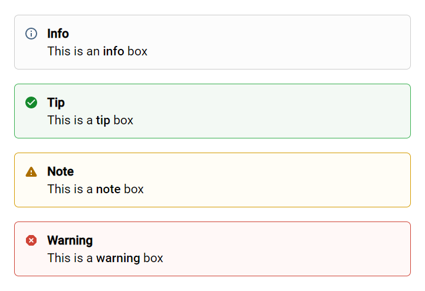
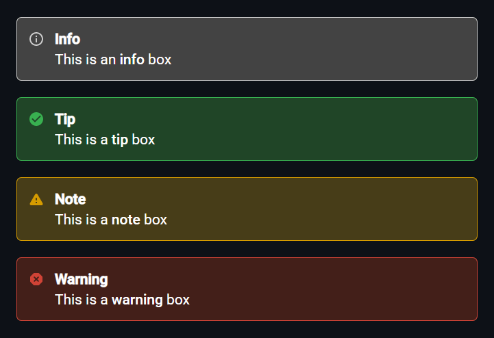

# pico-infobox-plugin
Pico plugin to create information boxes, based on the Confluence info/tip/note/warning macros (https://confluence.atlassian.com/doc/info-tip-note-and-warning-macros-51872369.html).

## Installation

Place the `PicoInfoboxPlugin` folder into the PicoCMS plugins folder.

## Usage

Information boxes can be created as following:

```
[info title=Info|icon=true]This is an **info** box[/info]
[tip title=Tip|icon=true]This is a **tip** box[/tip]
[note title=Note|icon=true]This is a **note** box[/note]
[warning title=Warning|icon=true]This is a **warning** box[/warning]
```

Choose from `info`, `tip`, `note`, or `warning` to create a box.

Use the `title` property to define the box's title. It is possible not to define a title for a box, by omitting this property.

Use the `icon` property, setting it to `true`or `false`, to enable or disable the box's icon. If this property is not specified, the icon will be enabled by default.

## Results

These are the results from the example presented above.

### Light Mode



### Dark Mode

